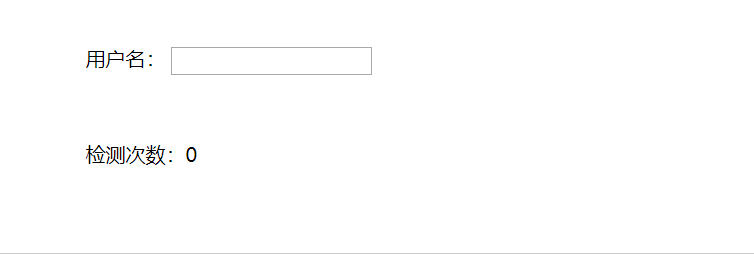
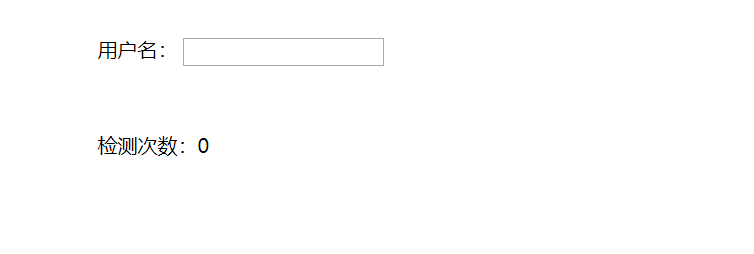
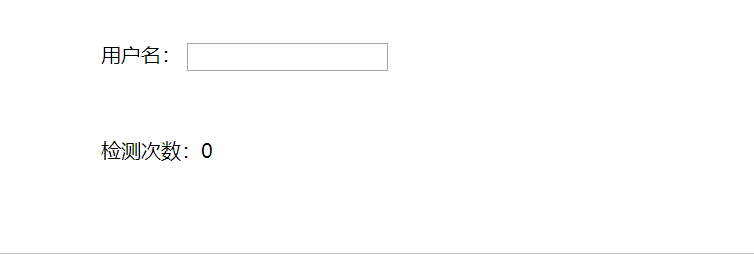
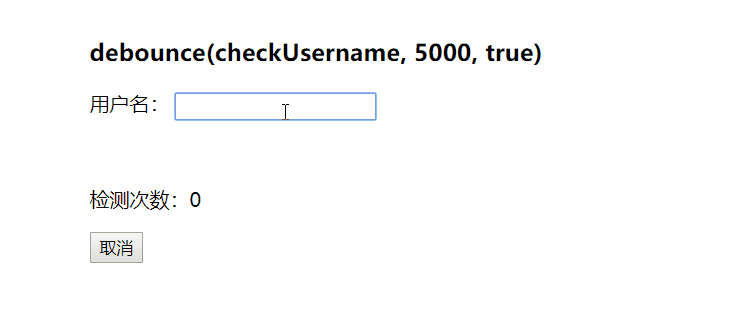
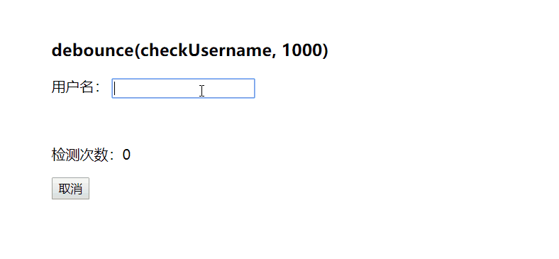

# 防抖与节流（上）

有时候在项目中需要监听 window 的 resize、 scroll，mousemove、keyup、keydown 等然后执行后续处理。如果后续处理比较复杂，而且在短时间不断重复触发，那么导致对内存消耗大、性能下降的问题。

为了解决这类问题，一般有两种方法：防抖 (debounce) 和节流 (throttle)。

## 案例

在用户注册的时候需要验证用户名是否符合一定规则，例如必须由 6~14 位的大小写英文字母、数字或者\_组成。在以前，常常是在输入框失焦后在判断。但是现在为了提高用户体验，也会改成用户输入实时判断。

## 常规做法

```html
<!DOCTYPE html>
<html lang="en">
<head>
  <meta charset="UTF-8">
  <title>debounce</title>
  <style>
    .usernameBox {
      width: 500px;
      margin: 100px auto;
    }
    .tip {
      color: red;
      visibility: hidden;
    }
  </style>
</head>

<body>
  <div class="usernameBox">
    <label for="username">用户名：</label>
    <input type="text" id="username">
    <p class="tip">用户名必须由 6~14 位的大小写英文字母、数字或者_组成！</p>
    <p>检测次数：<span class="count">0</span></p>
  </div>
  <script src="./debounce.js"></script>
</body>
</html>
```

```javascript
// debounce.js

const username = document.querySelector('#username');
const tip = document.querySelector('.tip');
const count = document.querySelector('.count');

username.addEventListener('input', checkUsername);

function checkUsername() {
  count.innerHTML = +count.innerHTML + 1;
  if (!/^[a-zA-Z0-9_]{6,14}$/.test(username.value)) {
    tip.style.visibility = 'visible';
  } else {
    tip.style.visibility = 'hidden';
  }
}
```

结果如下：



可以看到，在用户每次输入都判断是否符合条件，但是其实这是没有必要的。理想的情况是在用户输入期间并不一直判断，而当他停止输入后一段时间后在判断。

## 防抖 (debounce)

防抖，防止抖动。当持续触发事件时，合并事件，不会去触发后续操作。直到一定时间内没有触发再次这个事件时，就被认为这件事操作完成，才真正去触发后续操作。原理图如下：


（图片来自网络，侵删）

### debounce 基础版

写代码的思路就是，在后续操作 func 执行之前，先清除定时器，如果持续触发事件，就会不断地去清除定时器，直到操作结束之后，后续操作 func 才会执行。根据描述，于是就可以写成以下代码：

```javascript
// debounce.js

const username = document.querySelector('#username');
const tip = document.querySelector('.tip');
const count = document.querySelector('.count');

// username.addEventListener('input', checkUsername);
username.addEventListener('input', debounce(checkUsername, 500));

function checkUsername() {
  count.innerHTML = +count.innerHTML + 1;
  if (!/^[a-zA-Z0-9_]{6,14}$/.test(username.value)) {
    tip.style.visibility = 'visible';
  } else {
    tip.style.visibility = 'hidden';
  }
}

function debounce(func, wait) {
  let timer = null;

  return function() {
    const _this = this;
    const args = arguments;

    if (timer) {
      clearTimeout(timer);
    }

    // 注意下面的写法与 timer = setTimeout(func, wait) 的区别
    // 修正 this 指向，添上 arguments
    timer = setTimeout(() => {
      func.apply(_this, args);
    }, wait);
  };
}
```

结果如下：



只检测了 2 次，第一次是因为我打字慢了 (TAT)，效果还是很明显的。

### debounce 立即执行

上面的 debounce 适用于等待一段时间后才执行 func。但是有时候我们可能需要先立即执行 func， 然后等待一段时间后才能再次执行 func。

于是，第二版的 debounce 就是这样：

```javascript
// 调用
username.addEventListener('input', debounce(checkUsername, 500, true));

function debounce(func, wait, immediate = false) {
  let timer = null;
  let result;

  return function() {
    const _this = this;
    const args = arguments;

    if (timer) {
      clearTimeout(timer);
    }

    if (immediate) {
      // 初始化 timer = null，于是立即执行 func
      if (!timer) {
        // 如果有 func 返回值的话，返回结果
        result = func.apply(_this, args);
      }
      // 开启一个 setTimeout，在 wait 时间内，!timer = false，就不会再执行 func 了。
      timer = setTimeout(() => {
        timer = null;
      }, wait);
    } else {
      // 由于 setTimeout 包裹了 func.apply(_this, args)，所以获取不到返回值。
      timer = setTimeout(() => {
        func.apply(_this, args);
      }, wait);
    }

    return result;
  };
}
```

虽然再用用户名的例子不太恰当，但是暂时没想到适合的例子，于是就还是用它演示一下效果。



结果确实是立即执行 func ，并且在输入完成之前没有再次执行。

### debounce 取消

以上的 wait 时间很短，假如很长，可能会有在中途取消 debounce 的需求。这样的话，如果 immediate 为 true，就可以再次立即触发 func；如果 immediate 为 false，就可以不再触发 func。

```javascript
// 添加按钮
const btn = document.querySelector('.btn');
let check;

// 调用
username.addEventListener('input', (check = debounce(checkUsername, 3000)));

btn.addEventListener('click', () => {
  check.cancel();
});

function debounce(func, wait, immediate = false) {
  let timer = null;
  let result;

  let debounced = function() {
    const _this = this;
    const args = arguments;

    if (timer) {
      clearTimeout(timer);
    }

    if (immediate) {
      if (!timer) {
        result = func.apply(_this, args);
      }
      timer = setTimeout(() => {
        timer = null;
      }, wait);
    } else {
      timer = setTimeout(() => {
        func.apply(_this, args);
      }, wait);
    }

    return result;
  };

  // 取消
  debounced.cancel = function() {
    clearTimeout(timer);
    timer = null;
  };

  return debounced;
}
```



这是立即执行的情况，可以看出，本来应该是 5 秒之后才能再次检测的，按了取消之后，再次输入就会再次检测。



这是停止后才执行的情况，可以看出，本来应该 1 秒后检测的，按了取消之后，没有检测。
