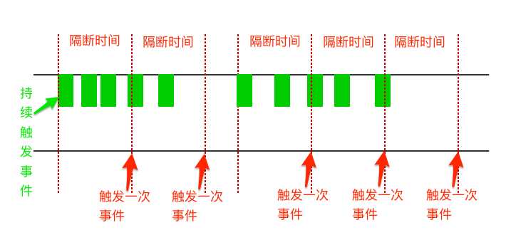

# 防抖与节流（下）

## 案例

输入小写字符串，转换成大写。

## 常规做法

```html
<!DOCTYPE html>
<html lang="en">
<head>
  <meta charset="UTF-8">
  <title>throttle</title>
  <style>
    .inputBox {
      width: 500px;
      margin: 100px auto;
    }
  </style>
</head>

<body>
  <div class="inputBox">
    <h3>小写转大写：</h3>
    <input type="text" class="oldStr">
    <p class="newStr"></p>
    <p>检测次数：<span class="count">0</span></p>
  </div>
  <script src="./throttle.js"></script>
</body>
</html>
```

```javascript
// throttle.js

const oldStr = document.querySelector('.oldStr');
const newStr = document.querySelector('.newStr');
const count = document.querySelector('.count');

oldStr.addEventListener('input', toUpper);

function toUpper() {
  count.innerHTML = +count.innerHTML + 1;
  newStr.innerHTML = oldStr.value.toUpperCase();
}
```

结果如下：


结果是输入时，每输入一次转换一次。其实不用这么频繁，只要一定的时间间隔内转换一次就足够。于是，使用 throttle 优化一下。

## 节流（throttle）

当持续触发事件时，保证隔间时间触发一次事件。原理图如下：



（图片来自网络，侵删）

### throttle 首部执行

当触发事件的时候，用当前的时间戳减去之前的时间戳（初始为 0），如果大于设置的时间周期，就执行后续操作，然后更新时间戳为当前的时间戳；如果小于，就不执行。

```javascript
// 调用
oldStr.addEventListener('input', throttle(toUpper, 500));

function throttle(func, wait) {
  let startTime = 0;

  return function() {
    const _this = this;
    const args = arguments;
    const curTime = new Date();

    if (curTime - startTime >= wait) {
      func.apply(_this, args);
      startTime = curTime;
    }
  };
}
```

结果如下：


可以看出输入 8 个字符，转换了 3 次，但是最后一次没有转换。因为时间间隔是 500 ms，最后一次输入不足 500 ms，不会触发 func。

### throttle 尾部执行

触发事件时，设置一个定时器，延迟执行 func。再触发事件的时候，如果定时器存在，就不执行。直到 wait 时间后，清空定时器，以便下次设置定时器，然后执行 func。

```javascript
// 调用
oldStr.addEventListener('input', throttle(toUpper, 500));

function throttle(func, wait) {
  let timer = null;

  return function() {
    const _this = this;
    const args = arguments;

    if (!timer) {
      timer = setTimeout(() => {
        timer = null;
        func.apply(_this, args);
      }, wait);
    }
  };
}
```

结果如下：


等待 500 ms 后执行，即使最后一次输入不足 500 ms，也会在 500 ms 后触发 func。

### throttle 首尾都执行

之前两种合并。一开始就执行，停止触发后还会执行一次。

```javascript
function throttle(func, wait) {
  let startTime = 0;
  let timer = null;

  return function() {
    const _this = this;
    const args = arguments;
    let curTime = new Date();
    const remaining = wait - (curTime - startTime); // 剩余时间

    if (remaining <= 0) {  // 首部执行
      if (timer) {
        clearTimeout(timer);
        timer = null;
      }
      func.apply(_this, args);
      startTime = curTime;
    } else if (!timer) { // 尾部执行
      timer = setTimeout(() => {
        startTime = new Date();
        timer = null;
        func.apply(_this, args);
      }, remaining);
    }
  };
}
```

结果如下：


### throttle 优化版

将上面上中情况结合起来，用一个对象控制。

- `leading` 表示是否添加首部执行，默认为 `false`。
- `trailing` 表示是否添加尾部执行，默认为 `true`。

```javascript
// 调用
// 1.首部执行
oldStr.addEventListener('input', throttle(toUpper, 500, { leading: true, trailing: false }));
// 2.首部执行（默认）
oldStr.addEventListener('input', throttle(toUpper, 500));
// 3.首尾部都执行
oldStr.addEventListener('input', throttle(toUpper, 500, { leading: true }));
// 或 oldStr.addEventListener('input', throttle(toUpper, 500, { leading: true, trailing: true }));

function throttle(func, wait, { leading = false, trailing = true } = {}) {
  let startTime = 0;
  let timer = null;

  return function() {
    const _this = this;
    const args = arguments;
    let curTime = new Date();

    // 如果是第一次执行，并且不需要首部执行
    if (!startTime && !leading) startTime = curTime;

    const remaining = wait - (curTime - startTime); // 剩余时间

    if (remaining <= 0) {  // 首部执行
      if (timer) {
        clearTimeout(timer);
        timer = null;
      }
      func.apply(_this, args);
      startTime = curTime;
    } else if (!timer && trailing) { // 尾部执行
      timer = setTimeout(() => {
        startTime = new Date();
        timer = null;
        func.apply(_this, args);
      }, remaining);
    }
  };
}
```

注意：

1. 下面三者是不同的。

    `function throttle(func, wait, options = { leading: false, trailing: true }) { // ... }`

    `function throttle(func, wait, { leading = false, trailing = true }) { // ... }`

    `function throttle(func, wait, { leading = false, trailing = true } = {}) { // ... }`

    - 第一种传对象参数时不能缺省属性。例如 `option` 只传 `{leading: true}` 进来，缺省了 `trailing` 属性，就会覆盖默认参数 `{leading = false, trailing = true}`，那么 `options.trailing` 就会是 `undefind`；后两种不会有这样的问题。
    - 第一种是 `options.leading` 和 `options.trailing`；后两种是 `leading` 和 `trailing`。
    - 第二种在调用时，如果缺省第三个参数，`leading` 和 `trailing` 都会不存在。第三种不会有这样的问题。默认就是 `leading` 为 `false`，`trailing` 为 `true`。

    关于默认参数与解构赋值默认值结合使用的详细指南，请参见[《阮一峰的ECMAScript 6 入门》的“函数的扩展”一章](http://es6.ruanyifeng.com/#docs/function#%E5%87%BD%E6%95%B0%E5%8F%82%E6%95%B0%E7%9A%84%E9%BB%98%E8%AE%A4%E5%80%BC)。
2. `leading` 和 `trailing` 不能都为 `false`。


### throttle 取消

```javascript
function throttle(func, wait, { leading = false, trailing = true } = {}) {
  let startTime = 0;
  let timer = null;

  let throttled = function() {
    const _this = this;
    const args = arguments;
    let curTime = new Date();

    // 如果是第一次执行，并且不需要首部执行
    if (!startTime && !leading) startTime = curTime;

    const remaining = wait - (curTime - startTime); // 剩余时间

    if (remaining <= 0) { // 首部执行
      if (timer) {
        clearTimeout(timer);
        timer = null;
      }
      func.apply(_this, args);
      startTime = curTime;
    } else if (!timer && trailing) { // 尾部执行
      timer = setTimeout(() => {
        startTime = new Date();
        timer = null;
        func.apply(_this, args);
      }, remaining);
    }
  };

  throttled.cancel = function() {
    clearTimeout(timer);
    timer = null;
    startTime = 0;
  };

  return throttled;
}
```
